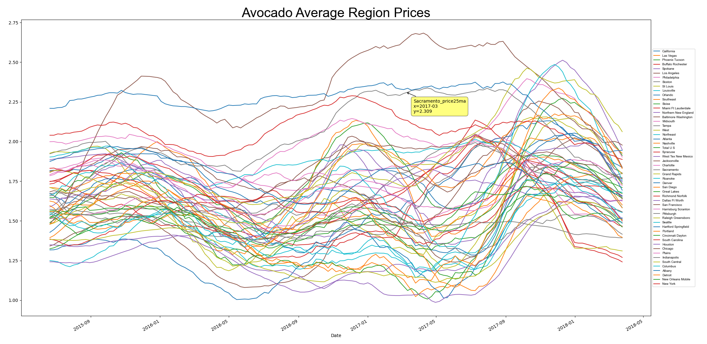

# Python Avocado Prices Graph

    

This program is to test Pandas, with simple graphing of avocado prices based on region and rolling mean.

# Dataset

The dataset, additional metadata, and the .csv file used in this program can be found at:
https://www.kaggle.com/datasets/neuromusic/avocado-prices

# Contribution 

If you'd like to contribute to `python_avocado_prices_graph` please submit a pull-request on a feature branch.

# Installing

Clone the repo:

    git clone https://github.com/Sommos/python_avocado_prices_graph

    cd python_avocado_prices_graph
